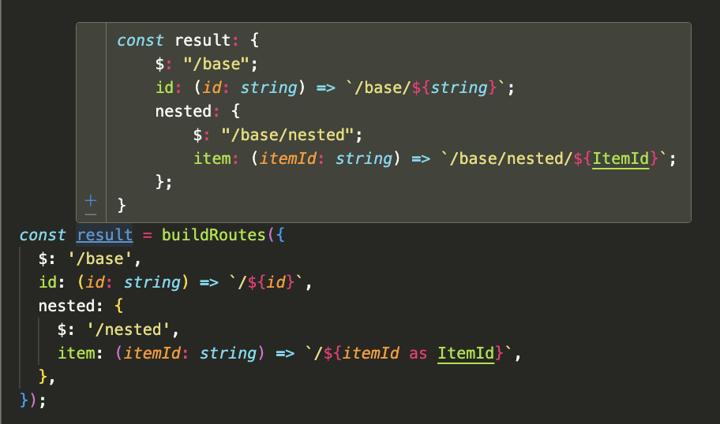
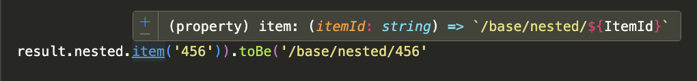

# Route Builder

Have you ever been frustrated by not having a good way to manage your application's routes in a type-safe manner? Are you resorting to magic strings scattered throughout your codebase, and constantly breaking prod when your api server tries to redirect to a non-existing route?

@gamesome/route-builder is here to help!

You can now build your application's routes in a type-safe way with support for dynamic segments like so:

```typescript
import { buildRoutes } from '@gamesome/route-builder';

const routes = buildRoutes({
	$: '/',
	user: {
		$: '/users',
		id: (userId: string) => `/${userId}`,
	},
});

// Static route
routes.$; // "/"
routes.user.$; // "/users"

// Dynamic route
routes.user.id('123'); // "/users/123"
```

In your IDE you will see autocompletion for both static and dynamic routes. as well as hints indicating what will be generated:

<picture>
  
</picture>

<picture>
  
</picture>

## Installation

```bash
npm install @gamesome/route-builder
# or
yarn add @gamesome/route-builder
```